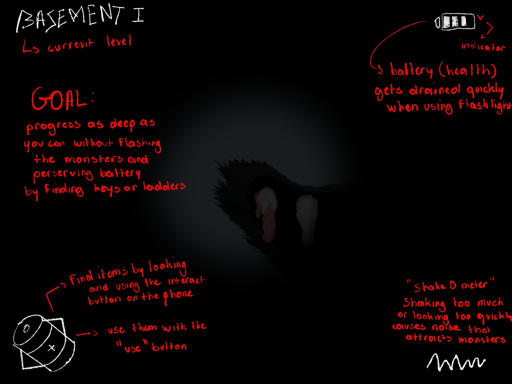
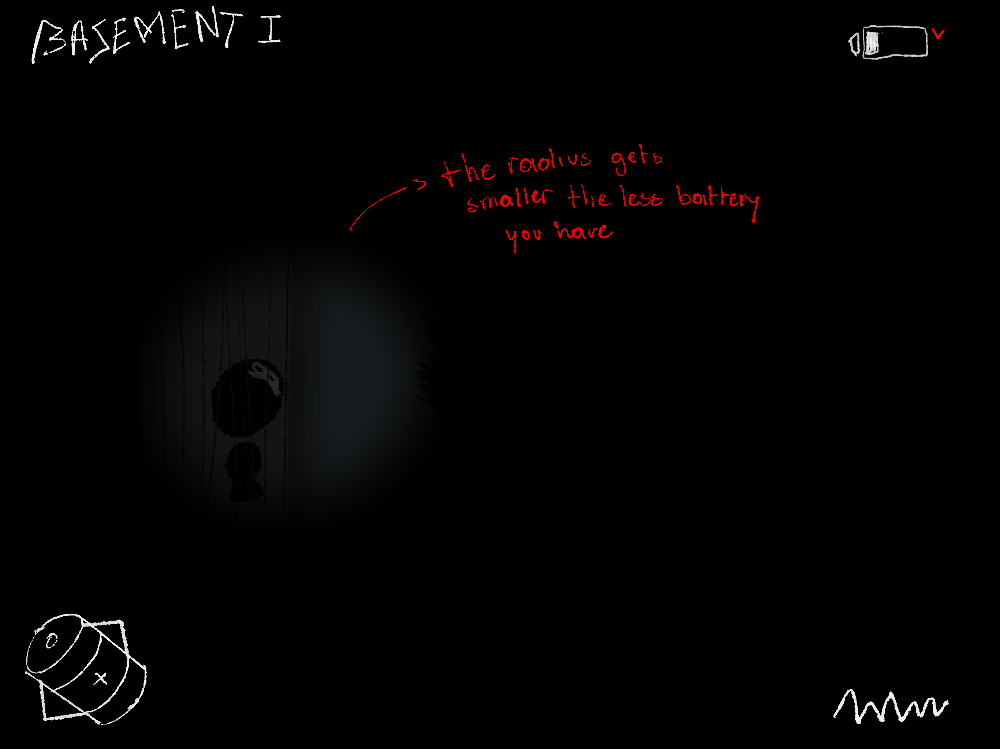
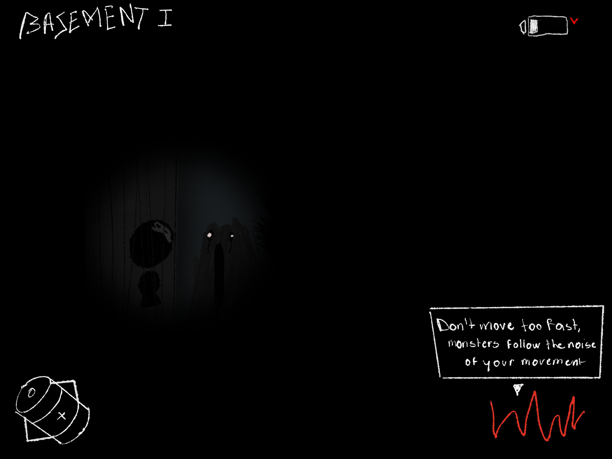
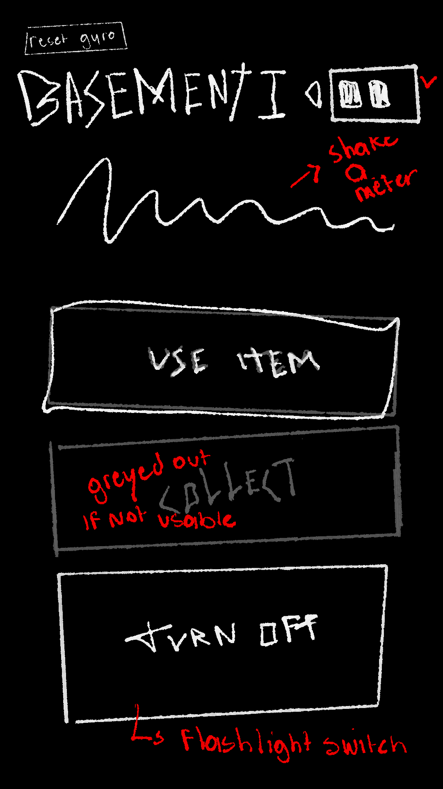

## Concept
Playing with the Light is a roguelike game where you use your phone as a flashlight and is the main surviving tool to explore and venture further into the depths of a demonic basement.

This concept is an original concept based on the roguelike genre and other horror games like "Don't Scream". 



Find keys and collect items that will help you find your way further down whilst avoiding monsters by shining them scared of your flashlight. If you wait too long the monsters WILL kill you. Your flashlight has a battery which goes down when you use it. If it's empty, there's no telling what will happen.




Be aware that your movements make noise, so don't move around too quickly as the monsters will hear you better. This is indicated in the bottom-right corner by the Shake O' Meter that makes your phone vibrate if you move too fast.



The mobile screen is a simple overlay of buttons that interacts on the main screen, you can collect items if your flashlight is shining towards an item. You can hold one item at a time so be mindful when to use them. You must and will turn off your flashlight to preserve battery.
There is also a reset gyro button if you feel your hand has to do inhumane movements in order to shine the light in the correct spot.

## Planning
### Week 1

- Look for a concept
- Set up a server with express
- Connect phone via websockets
- Set up a connection between sender and receiver via QR-code
- Implement basic gyro movement

### Week 2

- Implement phone buttons and interactions, sending basic data to the server
- Check for a way to update the battery indicator via spritesheet
- Make a calculation function for the "Shake O' Meter"
- Find a way of implementing a hitbox in the flashlight so that items can only be picked up by the user if the targeted item is within that hitbox

### Week 3
/


## Development Diary

### Week 1

```bash
npm init -y
npm install express
npm install socket.io
```
We'll be using simple-peer to make P2P easier to read and code since it makes multiple blocks of code obsolute.

Starting off we want to make the connection possible using a QR-Code. Luckily our teacher @ Devine has an exercise that demonstrates how this works:

Server.js
``` js
const express = require('express')
const app = express()
const http = require('http');
const server = http.createServer(app);
const { Server } = require("socket.io");
const os = require('os');
const io = new Server(server);
const port = process.env.PORT || 80;

const clients = {};
io.on('connection', socket => {
  clients[socket.id] = { id: socket.id };
  console.log('Socket connected', socket.id);

  clients[socket.id].x = 0;
  clients[socket.id].y = 0;

  socket.on('update', (targetSocketId, data) => {
    if (!clients[targetSocketId]) {
      return;
    }
    clients[socket.id].x = data.x;
    clients[socket.id].y = data.y;
    io.to(targetSocketId).emit('update', data);
  });

  socket.on('disconnect', () => {
    delete clients[socket.id];
  });

});

app.use(express.static('public'));

server.listen(port, () => {
  const networkInterfaces = os.networkInterfaces();
  for (const interfaceName in networkInterfaces) {
    for (const iface of networkInterfaces[interfaceName]) {
      if (iface.family === 'IPv4' && !iface.internal) {
        console.log(`http://${iface.address}`);
      }
    }
  }
  console.log(`App listening on port ${port}!`);
});
```
index.html
```html
<!DOCTYPE html>
<html lang="en">
<head>
  <meta charset="UTF-8">
  <meta name="viewport" content="width=device-width, initial-scale=1.0">
  <meta http-equiv="X-UA-Compatible" content="ie=edge">
  <title>Socket.io Desktop</title>
  <style>
    html {
      box-sizing: border-box;
    }
    *, *:before, *:after {
      box-sizing: inherit;
    }
    html, body {
      height: 100%;
      margin: 0;
    }

    .cursor {
      position: absolute;
      width: 1rem;
      height: 1rem;
      margin-left: -.5rem;
      margin-right: -.5rem;
      background: red;
      border-radius: 50% 50%;
    }
  </style>
</head>
<body>
  <a id="url" href=""></a>
  <div id="qr"></div>
  <script src="/socket.io/socket.io.js"></script>
  <script src="https://cdnjs.cloudflare.com/ajax/libs/qrcode-generator/1.4.4/qrcode.min.js" integrity="sha512-ZDSPMa/JM1D+7kdg2x3BsruQ6T/JpJo3jWDWkCZsP+5yVyp1KfESqLI+7RqB5k24F7p2cV7i2YHh/890y6P6Sw==" crossorigin="anonymous"></script>
  <script>
  {
    const $messages = document.getElementById('messages');
    const $url = document.getElementById('url');
    
    let socket; // will be assigned a value later
    
    const init = () => {
      socket = io.connect('/');
      socket.on('connect', () => {
        console.log(`Connected: ${socket.id}`);
        const url = `${new URL(`/controller.html?id=${socket.id}`, window.location)}`;
        $url.textContent = url;
        $url.setAttribute('href', url);

        const typeNumber = 4;
        const errorCorrectionLevel = 'L';
        const qr = qrcode(typeNumber, errorCorrectionLevel);
        qr.addData(url);
        qr.make();
        document.getElementById('qr').innerHTML = qr.createImgTag(4);
      });

      socket.on(`update`, data => {
        let $cursor = document.querySelector(`#cursor`);
        if(!$cursor) {
          $cursor = document.createElement(`div`);
          $cursor.classList.add(`cursor`);
          $cursor.setAttribute(`id`, `cursor`);
          document.body.appendChild($cursor);
        }
        $cursor.style.left = `${data.x * window.innerWidth}px`;
        $cursor.style.top = `${data.y * window.innerHeight}px`;
      });
    };

    init();
  }
  </script>
</body>
</html>
```

And the mobile.html

```html
<!DOCTYPE html>
<html lang="en">
<head>
  <meta charset="UTF-8">
  <meta name="viewport" content="width=device-width, initial-scale=1.0">
  <meta http-equiv="X-UA-Compatible" content="ie=edge">
  <title>Socket.io Controller</title>
  <style>
    html {
      box-sizing: border-box;
    }
    *, *:before, *:after {
      box-sizing: inherit;
    }
    html, body {
      height: 100%;
      margin: 0;
    }

    .cursor {
      position: absolute;
      width: 1rem;
      height: 1rem;
      margin-left: -.5rem;
      margin-right: -.5rem;
      background: red;
      border-radius: 50% 50%;
    }
  </style>
</head>
<body>
  <script src="/socket.io/socket.io.js"></script>
  <script>
  {
    const $messages = document.getElementById('messages');
    
    let socket; // will be assigned a value later
    
    const init = () => {
      targetSocketId = getUrlParameter('id');
      if (!targetSocketId) {
        alert(`Missing target ID in querystring`);
        return;
      }
      socket = io.connect('/');
      socket.on('connect', () => {
        console.log(`Connected: ${socket.id}`);
      });
      window.addEventListener(`mousemove`, e => handleMouseMove(e));
      window.addEventListener(`touchmove`, e => handleTouchMove(e));
    };

    const getUrlParameter = name => {
      name = name.replace(/[\[]/, '\\[').replace(/[\]]/, '\\]');
      const regex = new RegExp('[\\?&]' + name + '=([^&#]*)');
      const results = regex.exec(location.search);
      return results === null ? false : decodeURIComponent(results[1].replace(/\+/g, ' '));
    };

    const handleMouseMove = e => {
      if (socket.connected) {
        socket.emit(`update`, targetSocketId, {
          x: e.clientX / window.innerWidth,
          y: e.clientY / window.innerHeight
        });
      }
    };

    const handleTouchMove = e => {
      if (socket.connected) {
        socket.emit(`update`, targetSocketId, {
          x: e.touches[0].clientX / window.innerWidth,
          y: e.touches[0].clientY / window.innerHeight
        });
      }
    };

    init();
  }
  </script>
</body>
</html>
```

Now the challenge is to establish a peer 2 peer connection, this code makes the connection work via the server but when the server is down the connection gets lost. This is because we're still working with socket.io data transfer and not peer data transfer.

---
!! I use ChatGPT to simply make the connection work via EasyPeer instead of socket data transfer to make it work without the server: 

[(Given the code of my index.html and mobile.html) we establish a connection via an express server and using data transfer using socket.io, but i want to only use websockets to initialise the connection via websockets so that when the server goes down the connection still stands. Use EasyPeer to get peer 2 peer data transfer]


```html
<!DOCTYPE html>
<html lang="en">
<head>
  <meta charset="UTF-8">
  <meta name="viewport" content="width=device-width, initial-scale=1.0">
  <title>WebRTC</title>
  <style>
    video {
      max-width: 100%;
      height: auto;
    }
  </style>
</head>
<body>
  <h1>Sender</h1>
  <video id="myCamera" playsinline autoplay muted></video>
  <label for="peerSelect">Peer: </label><select id="peerSelect"></select>

  <script src="/socket.io/socket.io.js"></script>
  <script src="https://cdnjs.cloudflare.com/ajax/libs/simple-peer/9.11.1/simplepeer.min.js" integrity="sha512-0f7Ahsuvr+/P2btTY4mZIw9Vl23lS6LY/Y7amdkmUg2dqsUF+cTe4QjWvj/NIBHJoGksOiqndKQuI9yzn2hB0g==" crossorigin="anonymous" referrerpolicy="no-referrer"></script>
  <script type="module">

    const $myCamera = document.getElementById('myCamera');
    const $peerSelect = document.getElementById('peerSelect');

    let socket;
    let myStream;
    let peer;

    const servers = {
      iceServers: [{
        urls: 'stun:stun.l.google.com:19302'
      }]
    };

    const init = async () => {
      initSocket();
      $peerSelect.addEventListener('input', callSelectedPeer);
      const constraints = { audio: true, video: { width: 1280, height: 720 } };
      myStream = await navigator.mediaDevices.getUserMedia(constraints);
      $myCamera.srcObject = myStream;
      $myCamera.onloadedmetadata = () => $myCamera.play();
    };

    const initSocket = () => {
      socket = io.connect('/');
      socket.on('connect', () => {
        console.log(socket.id);
      });
      socket.on('clients', updatePeerList);

      socket.on('signal', async (myId, signal, peerId) => {
        console.log(`Received signal from ${peerId}`);
        console.log(signal);
        peer.signal(signal);
      });
    };

    const updatePeerList = (clients) => {
      $peerSelect.innerHTML = '<option value="none">--- Select Peer To Call ---</option>';
      for (const clientId in clients) {
        const isMyOwnId = (clientId === socket.id);
        if (clients.hasOwnProperty(clientId) && !isMyOwnId) {
          const client = clients[clientId];
          const $option = document.createElement('option');
          $option.value = clientId;
          $option.textContent = clientId;
          $peerSelect.appendChild($option);
        }
      }
    };

    const callSelectedPeer = async () => {
      if ($peerSelect.value === 'none') {
        // TODO: disconnect
        return;
      }
      console.log('call selected peer', $peerSelect.value);

      callPeer($peerSelect.value);
    };

    const callPeer = async (peerId) => {
      peer = new SimplePeer({ initiator: true, stream: myStream });
      peer.on('signal', data => {
        socket.emit('signal', peerId, data);
      });
    };

    init();

  </script>
</body>
</html>
```

```html
<!DOCTYPE html>
<html lang="en">
<head>
<meta charset="UTF-8">
<meta name="viewport" content="width=device-width, initial-scale=1.0">
<title>Laptop P2P Cursor</title>
<style>
html, body { height: 100%; margin:0; }
.cursor { position:absolute; width:1rem; height:1rem; background:red; border-radius:50%; margin:-0.5rem; }
</style>
</head>
<body>
<a id="url" href=""></a>
<div id="qr"></div>

<script src="/socket.io/socket.io.js"></script>
<script src="https://unpkg.com/easypeer/dist/easypeer.min.js"></script>
<script src="https://cdnjs.cloudflare.com/ajax/libs/qrcode-generator/1.4.4/qrcode.min.js"></script>

<script>
const $url = document.getElementById('url');
const socket = io();
let peer;

socket.on("connect", () => {
  console.log("Connected:", socket.id);

  // Generate QR code for phone
  const url = `${new URL(`/mobile.html?id=${socket.id}`, window.location)}`;
  $url.textContent = url;
  $url.href = url;

  const qr = qrcode(4, 'L');
  qr.addData(url);
  qr.make();
  document.getElementById('qr').innerHTML = qr.createImgTag(4);

  // Create EasyPeer initiator
  peer = new EasyPeer({ initiator:true, trickle:false });

  // Send signaling data to phone
  peer.on("signal", data => {
    if (peer.targetSocketId) socket.emit("signal", peer.targetSocketId, data);
  });

  // Receive cursor data from phone
  peer.on("data", data => {
    const msg = JSON.parse(data);
    let $cursor = document.querySelector("#cursor");
    if (!$cursor) {
      $cursor = document.createElement("div");
      $cursor.classList.add("cursor");
      $cursor.id = "cursor";
      document.body.appendChild($cursor);
    }
    $cursor.style.left = `${msg.x * window.innerWidth}px`;
    $cursor.style.top = `${msg.y * window.innerHeight}px`;
  });

  // Receive signaling messages from phone
  socket.on("signal", data => {
    if (!peer.targetSocketId) peer.targetSocketId = data.from;
    peer.signal(data);
  });
});
</script>
</body>
</html>
```

---

Starting up the server works via using the terminal command node server.js. Now we can test the code and quit the server to see the connection still stands.

Error message 

(index):53 Uncaught (in promise) ReferenceError: EasyPeer is not defined
    at Socket.<anonymous> ((index):53:7)
    at Emitter.emit (index.js:136:20)
    at Socket.onconnect (socket.js:612:14)
    at Socket.onpacket (socket.js:499:26)
    at Emitter.emit (index.js:136:20)
    at manager.js:217:18

!!! EasyPeer is not defined

In order to troubleshoot this problem GPT suggests to make a window.onload() command so that it registers the EasyPeer plugin first and then runs the code but it still won't work.

So instead of a moving cursor to test the data transfer I opted to use a simple button a log it in the laptop console.

The big oops is that I am using "EasyPeer" instead of "Simple Peer". So I installed it and imported it.

```bash
npm install simple-peer
```

The window.onload() function seems far stretched so I removed it. The error is now gone but now no data is being transferred. 

---
[Okay so nothing on the laptop side gets logged]

"Why nothing logs,
peer.targetSocketId is not set correctly before sending signals.
Phone might be connecting before laptop initiates signaling.
peer.connected is false because the signaling handshake didn’t complete."

```html
<!DOCTYPE html>
<html lang="en">
<head>
  <meta charset="UTF-8">
  <meta name="viewport" content="width=device-width, initial-scale=1.0">
  <title>Laptop P2P Button Logger</title>
</head>
<body>
  <a id="url" href=""></a>
  <div id="qr"></div>

  <script src="/socket.io/socket.io.js"></script>
  <script src="https://cdn.jsdelivr.net/npm/simple-peer@9.11.1/simplepeer.min.js"></script>
  <script src="https://cdnjs.cloudflare.com/ajax/libs/qrcode-generator/1.4.4/qrcode.min.js"></script>

  <script>
    const $url = document.getElementById('url');
    const socket = io();
    let peer;

    socket.on('connect', () => {
      console.log('Connected to server:', socket.id);

      // Generate QR code for phone
      const mobileUrl = `${new URL(`/mobile.html?id=${socket.id}`, window.location)}`;
      $url.textContent = mobileUrl;
      $url.href = mobileUrl;

      const qr = qrcode(4, 'L');
      qr.addData(mobileUrl);
      qr.make();
      document.getElementById('qr').innerHTML = qr.createImgTag(4);

      // Create SimplePeer initiator
      peer = new SimplePeer({ initiator: true, trickle: false });

      // Send signaling data to phone
      peer.on('signal', data => {
        if (peer.targetSocketId) {
          socket.emit('signal', peer.targetSocketId, data);
        }
      });

      // Receive messages from phone
      peer.on('data', data => {
        const msg = JSON.parse(data.toString());
        if (msg.type === 'buttonClick') {
          console.log('Phone button clicked!', msg);
        }
      });

      // Receive signaling messages from phone
      socket.on('signal', ({ from, signal }) => {
        if (!peer.targetSocketId) peer.targetSocketId = from;
        peer.signal(signal);
      });
    });
  </script>
</body>
</html>
```

```html
<!DOCTYPE html>
<html lang="en">
<head>
  <meta charset="UTF-8">
  <meta name="viewport" content="width=device-width, initial-scale=1.0">
  <title>Phone P2P Button</title>
</head>
<body>
  <button id="sendBtn">Click Me</button>

  <script src="/socket.io/socket.io.js"></script>
  <script src="https://cdn.jsdelivr.net/npm/simple-peer@9.11.1/simplepeer.min.js"></script>

  <script>
    const urlParams = new URLSearchParams(window.location.search);
    const laptopId = urlParams.get('id');
    const socket = io();
    let peer;

    socket.on('connect', () => {
      console.log('Phone connected, Socket ID:', socket.id);

      // Create SimplePeer non-initiator
      peer = new SimplePeer({ initiator: false, trickle: false });

      // Send signal to laptop
      peer.on('signal', data => {
        socket.emit('signal', laptopId, data);
      });

      // Receive signal from laptop
      socket.on('signal', data => {
        peer.signal(data);
      });

      // Wait until P2P connection established
      peer.on('connect', () => {
        console.log('P2P connected to laptop');

        // Button click sends message
        document.getElementById('sendBtn').addEventListener('click', () => {
          peer.send(JSON.stringify({ type: 'buttonClick' }));
          console.log('Sent buttonClick to laptop');
        });
      });

      peer.on('error', err => console.error('Peer error:', err));
    });
  </script>
</body>
</html>
```
---

Still the code used here doesn't work. So I give GPT the code of the exercise to compare it to see which differences there are and apply the method used from the exercise.

```js
socket.on('signal', data => {
    if (!peer.targetSocketId) peer.targetSocketId = data.from;
    peer.signal(data);
});
```
to 
```js
// server.js
socket.on('signal', (targetId, signal) => {
  const targetSocket = io.sockets.sockets.get(targetId);
  if (targetSocket) {
    targetSocket.emit('signal', { signal, from: socket.id });
  }
});
```

I apply this to my mobile and index.html 

server.js
```js
const express = require('express');
const app = express();
const http = require('http');
const server = http.createServer(app);
const { Server } = require("socket.io");
const os = require('os');

const io = new Server(server);
const port = process.env.PORT || 3000;

app.use(express.static('public'));

io.on('connection', socket => {
  console.log('Socket connected:', socket.id);

  // Forward signaling messages
  socket.on('signal', (targetId, signal) => {
    const target = io.sockets.sockets.get(targetId);
    if (target) target.emit('signal', { signal, from: socket.id });
  });

  // Phone readiness
  socket.on('phone-ready', laptopId => {
    io.to(laptopId).emit('phone-ready', socket.id);
  });

  socket.on('disconnect', () => {
    console.log('Socket disconnected:', socket.id);
  });
});

server.listen(port, () => {
  const interfaces = os.networkInterfaces();
  console.log(`Server running on port ${port}`);
  for (const name in interfaces) {
    for (const iface of interfaces[name]) {
      if (iface.family === 'IPv4' && !iface.internal) {
        console.log(`http://${iface.address}:${port}`);
      }
    }
  }
});
```

index.html
```html
<!DOCTYPE html>
<html lang="en">
<head>
<meta charset="UTF-8">
<meta name="viewport" content="width=device-width, initial-scale=1.0">
<title>Laptop P2P Button Logger</title>
</head>
<body>
<h2>Laptop</h2>
<a id="url" href=""></a>
<div id="qr"></div>

<script src="/socket.io/socket.io.js"></script>
<script src="https://cdn.jsdelivr.net/npm/simple-peer@9.11.1/simplepeer.min.js"></script>
<script src="https://cdnjs.cloudflare.com/ajax/libs/qrcode-generator/1.4.4/qrcode.min.js"></script>

<script>
const $url = document.getElementById('url');
const socket = io();
let peer;

socket.on('connect', () => {
  console.log('Connected to server:', socket.id);

  // Generate QR code for phone
  const mobileUrl = `${new URL(`/mobile.html?id=${socket.id}`, window.location)}`;
  $url.textContent = mobileUrl;
  $url.href = mobileUrl;

  const qr = qrcode(4, 'L');
  qr.addData(mobileUrl);
  qr.make();
  document.getElementById('qr').innerHTML = qr.createImgTag(4);

  // Wait until a phone connects before creating initiator peer
  socket.on('phone-ready', phoneId => {
    console.log('Phone ready:', phoneId);
    peer = new SimplePeer({ initiator: true, trickle: false });

    // Send signaling data to phone
    peer.on('signal', data => socket.emit('signal', phoneId, data));

    // Receive messages from phone
    peer.on('data', data => {
      const msg = JSON.parse(data.toString());
      if (msg.type === 'buttonClick') {
        console.log('Phone button clicked!', msg);
      }
    });

    // Handle signaling from phone
    socket.on('signal', ({ signal, from }) => {
      if (from === phoneId) peer.signal(signal);
    });
  });
});
</script>
</body>
</html>
```

mobile.html

```html
<!DOCTYPE html>
<html lang="en">
<head>
<meta charset="UTF-8">
<meta name="viewport" content="width=device-width, initial-scale=1.0">
<title>Phone P2P Button</title>
</head>
<body>
<h2>Phone</h2>
<button id="sendBtn">Click Me</button>

<script src="/socket.io/socket.io.js"></script>
<script src="https://cdn.jsdelivr.net/npm/simple-peer@9.11.1/simplepeer.min.js"></script>

<script>
const urlParams = new URLSearchParams(window.location.search);
const laptopId = urlParams.get('id');
const socket = io();
let peer;

socket.on('connect', () => {
  console.log('Phone connected, Socket ID:', socket.id);

  // Let laptop know this phone is ready
  socket.emit('phone-ready', laptopId);

  // Create non-initiator peer
  peer = new SimplePeer({ initiator: false, trickle: false });

  peer.on('signal', data => {
    socket.emit('signal', laptopId, data);
  });

  socket.on('signal', ({ signal }) => {
    peer.signal(signal);
  });

  peer.on('connect', () => {
    console.log('P2P connected to laptop');
    document.getElementById('sendBtn').addEventListener('click', () => {
      peer.send(JSON.stringify({ type: 'buttonClick' }));
      console.log('Sent buttonClick to laptop');
    });
  });

  peer.on('error', err => console.error('Peer error:', err));
});
</script>
</body>
</html>
```

Now when I connect my phone to my pc and click the button the event gets logged. WOOHOO!! Even when the server gets cut out, the connection between laptop and phone still stands. Refreshing ofcourse loses the connection. 